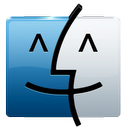

#  XtraFinder 破解版
## 简介
- XtraFinder是一款非常强大的Finder文件管理器的增强插件
- 增强的项目有：多选项卡同时双面板文件管理，ctrl+x剪切文件，文件夹和文件分开排序，退格键返回，回车键打开，右键新建文件，右键定位到控制台，右键移动到，右键彻底删除，美化界面等
- 在此提供的是出于学习目的的破解版。安装需要自行关闭SIP，已测试成功于macOS Mojave v10.14.3

## 下载地址
- [XtraFinder-Crack](./../../releases)

## 破解方法
1. 先拖动app到 "Applications" 进行安装，然后在 "应用程序" 里启动一次该app；
2. 当安装包里有个叫 "xxxx Crack" 的程序时才有这一步骤，双击执行 "xxxx Crack"，然后重新启动app；
3. 欣赏之。

## 声明
- 此破解软件/补丁/方法仅限用于学习和研究目的；
- 不得将上述内容用于商业或者非法用途，否则，一切后果请用户自负；
- 因使用上述内容造成的损失，全部由使用者本人承担；
- 用户必须在下载后的24个小时之内，从自己的电脑中彻底删除上述内容；
- 如果用户喜欢，请支持正版，购买与注册，得到更好的正版服务。
